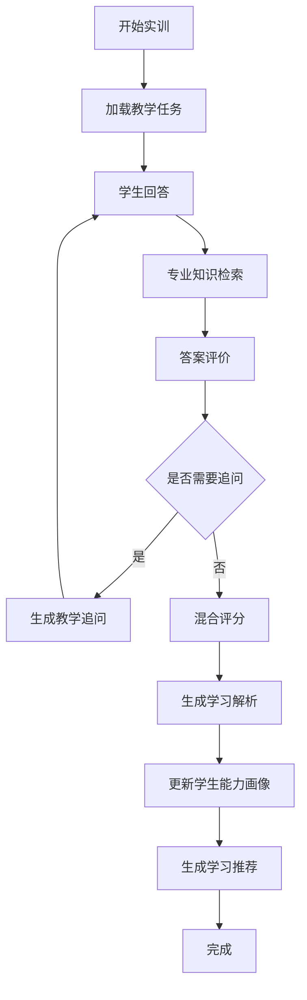

# Claude Code 总控开发提示词
# 项目：油训智安——油气储运工程岗位智能实训与安全能力评测系统

你现在是一名资深 AI 系统架构师、Python 后端工程师、Vue 前端工程师、RAG 工程师、数据库工程师、职业教育数字化产品工程师和 DevOps 工程师。

请在当前代码仓库中，从 0 到 1 设计、开发、测试并完善一个真正可以运行、部署和比赛演示的 Web 项目。

---

# 一、项目基本信息

## 项目名称

**油训智安**

英文内部代号：

`OilTrainSafe`

## 项目副标题

**面向油气储运工程专业的岗位智能实训与安全能力评测系统**

---

# 二、项目定位

本系统面向：

**油气储运工程专业学生、专业教师及实训教学场景。**

核心岗位方向：

**油气管道站场运行操作相关岗位**

系统不是普通 AI 聊天机器人，而是一套：

**岗位能力图谱 + 专业知识 RAG + 情境化实训 + AI 教学追问 + 混合评价 + 学生能力画像 + 个性化推荐**

组成的智能实训系统。

核心目标：

> 将油气储运工程专业知识、岗位典型工作任务和 AI 技术结合，构建“岗位—任务—训练—评价—画像—推荐”的完整教学闭环。

---

# 三、核心应用场景

至少支持：

1. 油气管道站场工艺流程认知
2. 站场日常巡检训练
3. 阀门及管件认知
4. 泵、压缩机等设备认知
5. 仪表与工艺参数认知
6. 工艺异常信息识别
7. 泄漏及安全风险辨识
8. HSE 安全知识训练
9. 巡检记录规范训练
10. 岗位标准规范查询
11. 学生岗位能力评价
12. 个性化学习路径推荐

---

# 四、系统安全边界

这是一个：

**职业教育教学与虚拟实训系统。**

不是：

- 实际生产控制系统
- SCADA 控制系统
- DCS 控制系统
- 设备远程控制系统
- 企业生产决策系统
- 真实应急指挥系统

系统不得连接真实油气生产设备。

系统不得输出可以直接用于真实生产现场控制的危险设备操作指令。

所有实训案例中的：

- 压力
- 温度
- 流量
- 液位
- 设备状态
- 故障现象
- 工艺条件

均必须明确为：

**教学模拟数据或经过脱敏处理的数据。**

---

# 五、总体技术栈

除非存在明确兼容性问题，否则保持以下技术栈。

## 5.1 前端

使用：

- Vue 3
- TypeScript
- Vite
- Vue Router
- Pinia
- Element Plus
- Axios
- ECharts

要求：

- Composition API
- `<script setup lang="ts">`
- 完整 TypeScript 类型
- 统一 API 层
- 统一错误处理
- Responsive 基础适配

## 5.2 后端

使用：

- Python 3.11+
- FastAPI
- Uvicorn
- Pydantic v2
- pydantic-settings
- SQLAlchemy 2.x
- Alembic
- PostgreSQL
- httpx
- OpenAI Python SDK

所有外部 IO 优先使用 async。

## 5.3 大语言模型

使用：

**阿里云百炼 API**

优先：

**OpenAI Compatible API**

主要使用：

**Qwen 系列大语言模型**

具体模型名称禁止直接写死在业务代码。

通过环境变量：

```env
BAILIAN_API_KEY=
BAILIAN_BASE_URL=
BAILIAN_MODEL=
BAILIAN_TEMPERATURE=0.2
BAILIAN_TIMEOUT=60
BAILIAN_MAX_RETRIES=3
```

API Key：

- 只存在后端环境变量
- 不进入 Git
- 不发送给前端
- 不写入日志

---

# 六、AI 使用原则

大模型只是：

**系统中的语言推理组件。**

大模型不能控制整个系统。

以下功能必须由代码控制：

- Workflow 路由
- Workflow 状态
- 业务流程
- 安全检查
- 数据权限
- 最终评分
- 能力画像更新
- 推荐算法
- 用户身份
- 数据持久化

大模型主要负责：

- 意图理解
- Query Rewrite
- 学习任务内容生成
- 情境描述生成
- 苏格拉底式教学追问
- 学生回答语言分析
- 推理质量评价
- 专业知识解释
- 个性化反馈文字生成

---

# 七、工作流实现原则

核心工作流必须自行实现。

禁止使用以下技术作为核心业务流程编排器：

- LangGraph
- LangChain Agent
- Dify Workflow
- Coze Workflow
- CrewAI
- AutoGen
- 第三方 Agent 可视化工作流

允许使用基础 Python 库。

必须自行开发：

# Workflow Engine

采用：

**有限状态机 + 条件路由**

思想实现。

---

# 八、系统总体架构

按照以下逻辑设计：

```text
                    Vue3 Web Application
                             │
                             ▼
                     FastAPI Backend
                             │
               ┌─────────────┴─────────────┐
               │                           │
        Authentication              Workflow Engine
                                           │
             ┌─────────────────────────────┼──────────────────────┐
             │                             │                      │
             ▼                             ▼                      ▼
       Safety Guard                  RAG Engine            Evaluation Engine
                                           │
                                  ┌────────┼────────┐
                                  │        │        │
                                BGE-M3   Qdrant   Reranker
                                  │
                                  ▼
                            Prompt Builder
                                  │
                                  ▼
                             LLM Gateway
                                  │
                                  ▼
                         Alibaba Bailian API
                                  │
                                  ▼
                         Structured Output
                                  │
             ┌────────────────────┼───────────────────┐
             ▼                    ▼                   ▼
       Ability Profile     Recommendation      Knowledge Citation
             │
             ▼
         PostgreSQL
```

---

# 九、项目目录

采用 Monorepo。

建议结构：

```text
oil-train-safe/
│
├── frontend/
│   ├── src/
│   │   ├── api/
│   │   ├── assets/
│   │   ├── components/
│   │   ├── layouts/
│   │   ├── router/
│   │   ├── stores/
│   │   ├── types/
│   │   ├── utils/
│   │   └── views/
│   ├── package.json
│   └── vite.config.ts
│
├── backend/
│   ├── app/
│   │   ├── api/
│   │   ├── core/
│   │   ├── db/
│   │   ├── models/
│   │   ├── schemas/
│   │   ├── services/
│   │
│   │   ├── workflow/
│   │   │   ├── engine.py
│   │   │   ├── context.py
│   │   │   ├── enums.py
│   │   │   ├── registry.py
│   │   │   ├── router.py
│   │   │   └── nodes/
│   │
│   │   ├── llm/
│   │   │   ├── base.py
│   │   │   ├── gateway.py
│   │   │   └── bailian.py
│   │
│   │   ├── rag/
│   │   │   ├── parser.py
│   │   │   ├── cleaner.py
│   │   │   ├── chunker.py
│   │   │   ├── embedding.py
│   │   │   ├── retriever.py
│   │   │   ├── reranker.py
│   │   │   └── citation.py
│   │
│   │   ├── evaluation/
│   │   │   ├── rule_score.py
│   │   │   ├── semantic_score.py
│   │   │   ├── llm_score.py
│   │   │   └── final_score.py
│   │
│   │   ├── safety/
│   │   │   ├── guard.py
│   │   │   ├── rules.py
│   │   │   └── output_guard.py
│   │
│   │   ├── recommendation/
│   │   ├── knowledge/
│   │   └── main.py
│
│   ├── tests/
│   ├── alembic/
│   └── pyproject.toml
│
├── data/
│   ├── knowledge/
│   ├── standards/
│   ├── textbooks/
│   └── training_cases/
│
├── scripts/
├── docs/
├── docker/
│
├── docker-compose.yml
├── .env.example
├── .gitignore
└── README.md
```

可以优化目录，但必须保持清晰模块边界。

---

# 十、用户角色

至少支持：

## Student

学生能够：

- 登录
- 查看岗位能力图谱
- 查看岗位典型工作任务
- 选择实训任务
- 开始 AI 情境训练
- 回答问题
- 接受 AI 追问
- 查看最终评价
- 查看知识依据
- 查看能力雷达图
- 查看历史训练记录
- 查看错误分析
- 获取个性化学习推荐
- 使用专业知识问答

## Teacher

教师能够：

- 查看学生列表
- 查看学生能力画像
- 查看训练记录
- 查看学生薄弱能力
- 创建学习任务
- AI 辅助生成教学任务
- 编辑学习任务
- 查看知识库
- 查看教学统计

MVP 阶段教师端可以相对简洁。

---

# 十一、岗位能力模型

系统初始化岗位：

**油气管道站场运行操作相关岗位**

典型工作任务至少包括：

1. 站场工艺流程识读
2. 日常巡检
3. 阀门及管件状态检查
4. 泵等设备状态认知
5. 压缩机等设备状态认知
6. 仪表参数读取
7. 工艺异常信息识别
8. 泄漏风险辨识
9. 消防设施检查
10. HSE 风险辨识
11. 巡检记录填写
12. 异常信息报告
13. 标准规范查询

---

# 十二、六维岗位能力

定义：

```text
process_understanding
工艺流程认知

equipment_recognition
设备认知

instrument_parameter
参数与仪表认知

abnormal_detection
异常识别

safety_awareness
安全风险辨识

standard_recording
规范表达与记录
```

默认权重：

```text
工艺流程认知        20%
设备认知            15%
参数与仪表认知      15%
异常识别            20%
安全风险辨识        20%
规范表达与记录      10%
```

权重必须存入数据库或统一配置。

禁止散落硬编码。

---

# 十三、岗位能力图谱

第一版使用：

**PostgreSQL + ECharts Graph**

不引入额外图数据库。

关系：

```text
岗位
↓
典型工作任务
↓
岗位能力
↓
知识点
↓
技能点
```

前端支持点击节点查看：

- 节点名称
- 类型
- 描述
- 关联任务
- 关联知识
- 推荐训练

---

# 十四、自研 Workflow Engine

这是整个系统最重要的核心模块。

必须实现：

- WorkflowContext
- BaseWorkflowNode
- NodeRegistry
- ConditionalRouter
- WorkflowEngine
- WorkflowState
- WorkflowPersistence
- ExecutionLog
- Retry
- Error Handling
- async node
- 中断恢复

---

# 十五、WorkflowContext

使用 Pydantic。

至少包含：

```python
workflow_id
session_id
user_id
role
intent
mode
current_node
current_stage
user_input
task_id
current_task
retrieved_documents
student_answer
evaluation_result
score
ability_scores
safety_level
messages
attempt_count
metadata
next_node
error
```

必须可以：

```python
context.model_dump()
```

并保存为 JSON。

---

# 十六、节点统一接口

实现：

```python
from abc import ABC, abstractmethod

class BaseWorkflowNode(ABC):

    name: str

    @abstractmethod
    async def execute(
        self,
        context: WorkflowContext
    ) -> WorkflowContext:
        ...
```

每个核心 Node 独立文件。

---

# 十七、Workflow Node

至少实现：

```text
IntentNode
ContextNode
ClarifyNode
SafetyNode
QueryRewriteNode
RetrieveNode
RerankNode
TeachingStrategyNode
TaskGenerateNode
StudentAnswerNode
EvaluateNode
FollowUpNode
ExplainNode
ProfileUpdateNode
RecommendNode
OutputGuardNode
```

---

# 十八、工作流状态

定义：

```text
PENDING
RUNNING
SUCCESS
WAITING_INPUT
RETRY
FAILED
SERVICE_UNAVAILABLE
COMPLETED
```

状态必须持久化。

---

# 十九、专业知识问答 Workflow

流程：

```text
START
  ↓
IntentNode
  ↓
SafetyNode
  ↓
QueryRewriteNode
  ↓
RetrieveNode
  ↓
RerankNode
  ↓
Prompt Builder
  ↓
Bailian
  ↓
Structured Output
  ↓
OutputGuardNode
  ↓
Citation Builder
  ↓
END
```

回答至少包含：

- 核心解释
- 相关知识点
- 专业依据
- 来源信息
- 必要安全提示

不得编造不存在的标准。

---

# 二十、AI 情境实训 Workflow

这是系统核心。

流程：

```text
START
  ↓
加载 Training Task
  ↓
加载能力目标
  ↓
生成/加载教学模拟情境
  ↓
StudentAnswerNode
  ↓
RetrieveNode
  ↓
RerankNode
  ↓
EvaluateNode
  ↓
是否需要继续追问？
  │
  ├── YES
  │     ↓
  │ FollowUpNode
  │     ↓
  │ WAITING_INPUT
  │     ↓
  │ StudentAnswerNode
  │     ↓
  │ EvaluateNode
  │
  └── NO
        ↓
   Hybrid Final Score
        ↓
   ExplainNode
        ↓
   ProfileUpdateNode
        ↓
   RecommendNode
        ↓
       END
```

最大追问次数：

```env
MAX_TRAINING_FOLLOW_UPS=3
```

禁止无限循环。

---

# 二十一、教学策略

训练模式采用：

**苏格拉底式引导教学。**

第一次回答不完整时，AI 不直接公布标准答案，而应该通过追问引导学生继续分析。

目标：

```text
观察
↓
信息提取
↓
判断
↓
说明依据
↓
风险分析
↓
规范表达
```

---

# 二十二、RAG 技术路线

必须自行实现专业 RAG Pipeline。

文档处理：

```text
PDF / TXT / Markdown
↓
PyMuPDF
↓
文本清洗
↓
章节识别
↓
Chunk
↓
Metadata
↓
BGE-M3
↓
Qdrant
```

查询：

```text
User Query
↓
Query Rewrite
↓
BGE-M3 Embedding
↓
Qdrant Top 20
↓
Metadata Filter
↓
BGE-Reranker
↓
Top 5
↓
Prompt Builder
↓
Bailian Qwen
```

---

# 二十三、专业知识 Metadata

每个 Chunk 至少包含：

```json
{
  "knowledge_id": "HSE-001",
  "title": "",
  "major": "油气储运工程",
  "position": "",
  "job_task": "",
  "ability": "",
  "knowledge_point": "",
  "skill_point": "",
  "difficulty": 1,
  "content": "",
  "source_type": "",
  "source_name": "",
  "source_no": "",
  "page": null,
  "chapter": "",
  "safety_level": "",
  "tags": []
}
```

Qdrant Payload 保留这些 Metadata。

---

# 二十四、知识来源

系统必须支持导入：

- 国家标准
- 行业标准
- 教材
- 课程标准
- 实训指导书
- 学校教学资料
- 经确认的专业教学资料

必须保留来源。

专业回答需要尽量返回：

```text
来源名称
标准/文件编号
章节
页码
```

如果原文没有明确依据，不得自行生成假的来源信息。

---

# 二十五、知识库导入工具

实现：

```bash
python scripts/import_knowledge.py
```

支持：

```text
PDF
TXT
Markdown
```

至少支持参数：

```bash
python scripts/import_knowledge.py \
  --path data/standards/xxx.pdf \
  --source-type standard
```

执行：

```text
解析
↓
切片
↓
Metadata
↓
Embedding
↓
写入 Qdrant
↓
写入 PostgreSQL Metadata
```

---

# 二十六、Embedding

使用：

**BGE-M3**

封装：

```python
class EmbeddingService:

    async def embed_query(self, text: str):
        ...

    async def embed_documents(
        self,
        texts: list[str]
    ):
        ...
```

Embedding 逻辑不得散落在业务代码中。

---

# 二十七、Reranker

使用：

**BGE-Reranker**

输入：

```text
Query
+
Retrieved Documents
```

输出：

```text
rerank_score
```

根据 Score 排序后选择 Top N。

相关参数统一配置：

```env
RAG_RETRIEVE_TOP_K=20
RAG_RERANK_TOP_K=5
```

---

# 二十八、LLM Gateway

定义：

```python
class LLMProvider:

    async def chat(...):
        ...

    async def structured_output(...):
        ...

    async def health_check(...):
        ...
```

当前实现：

```text
BailianProvider
```

业务代码不得直接实例化 OpenAI Client。

统一经过：

```text
LLMGateway
```

---

# 二十九、阿里云百炼调用

推荐：

```python
from openai import AsyncOpenAI

client = AsyncOpenAI(
    api_key=settings.BAILIAN_API_KEY,
    base_url=settings.BAILIAN_BASE_URL
)
```

具体 API Client 只允许存在：

```text
backend/app/llm/
```

模块。

---

# 三十、结构化输出

以下任务必须尽量采用结构化结果：

- Intent
- Task Generation
- Evaluation
- Recommendation
- Query Analysis

使用：

**Pydantic Schema Validation**

例如：

```python
class EvaluationOutput(BaseModel):

    reasoning_quality: int
    completeness: int
    safety_awareness: int
    detected_errors: list[str]
    missing_points: list[str]
    need_follow_up: bool
    follow_up_question: str | None
    feedback: str
```

---

# 三十一、Structured Output 修复

流程：

```text
LLM
↓
JSON
↓
Pydantic Validation
```

失败：

```text
Structured Repair
↓
再次请求
↓
Validation
```

最大次数：

```env
STRUCTURED_OUTPUT_MAX_RETRIES=2
```

持续失败则返回明确错误。

---

# 三十二、混合评分引擎

绝对不能让 LLM 单独决定学生最终成绩。

实现：

# Hybrid Evaluation Engine

组成：

```text
Rule Score      40%
Semantic Score  30%
LLM Score       30%
```

所有权重统一配置。

---

# 三十三、Rule Score

负责客观评分。

检测：

- 关键点覆盖
- 关键风险遗漏
- 原则性错误
- 必要步骤完整度
- 安全意识

---

# 三十四、Semantic Score

使用：

BGE-M3 Embedding

计算：

```text
Student Answer
vs
Reference Key Points
```

的语义相关度。

禁止只依靠关键词。

---

# 三十五、LLM Score

百炼主要评价：

- 推理过程
- 原因解释
- 表达质量
- 完整性
- 是否形成岗位思维

LLM Score 不能直接成为 Final Score。

---

# 三十六、Final Score

实现：

```text
Final Score
=
Rule Score × rule_weight
+
Semantic Score × semantic_weight
+
LLM Score × llm_weight
```

并输出：

```json
{
  "final_score": 82,
  "rule_score": 85,
  "semantic_score": 79,
  "llm_score": 80
}
```

---

# 三十七、能力画像

六个能力维度：

```text
工艺流程认知
设备认知
参数与仪表认知
异常识别
安全风险辨识
规范表达与记录
```

每完成一次训练：

```text
Training Result
↓
映射 Ability
↓
计算增量
↓
更新 Ability Profile
↓
保存 History
```

不得覆盖历史。

---

# 三十八、能力历史

至少保存：

```text
student_id
ability_id
before_score
training_score
after_score
training_session_id
created_at
```

前端通过 ECharts 显示：

- Radar
- Trend

---

# 三十九、推荐引擎

第一阶段使用：

**规则推荐 + 能力匹配**

流程：

```text
读取六维能力
↓
找到最低能力
↓
查询相关知识点
↓
查询对应实训任务
↓
判断当前难度
↓
推荐下一任务
```

推荐结果包含：

```text
任务名称
目标能力
推荐原因
难度
预计时间
```

推荐逻辑由代码完成。

AI 负责将推荐理由转换成自然语言。

---

# 四十、安全模块

独立实现：

```text
SafetyGuard
```

包括：

```text
Input Guard
Output Guard
```

---

# 四十一、Input Guard

识别：

- 真实设备操作
- 真实控制参数
- 绕过联锁
- SCADA 控制
- DCS 控制
- 企业敏感生产数据
- 将系统用于真实应急指挥
- 危险生产操作要求

出现相关内容：

进入：

```text
Safety Education Response
```

而不是继续作为生产指导回答。

---

# 四十二、Output Guard

检查：

- 是否生成危险控制指令
- 是否出现来源无法确认的专业标准
- 是否把教学模拟数据描述为真实数据
- 是否存在明显安全风险
- 是否缺少必要教学安全声明

---

# 四十三、统一教学安全说明

AI 实训页面固定展示：

> ⚠ 油训智安仅用于油气储运工程教学、虚拟实训和岗位技能学习，不作为真实油气生产现场操作、控制、维护或应急处置依据。系统中的工况、参数和案例均为教学模拟或脱敏数据。

---

# 四十四、数据库

使用：

**PostgreSQL + SQLAlchemy 2.x**

至少建立：

```text
User
Role
Position
JobTask
Ability
KnowledgePoint
SkillPoint
PositionAbilityRelation
TaskAbilityRelation
TrainingTask
TrainingScenario
TrainingSession
StudentAnswer
EvaluationResult
AbilityScore
AbilityHistory
KnowledgeItem
ErrorRecord
LearningRecommendation
ChatSession
ChatMessage
WorkflowInstance
WorkflowExecutionLog
```

---

# 四十五、数据库迁移

必须使用：

**Alembic**

正式启动禁止依赖：

```python
Base.metadata.create_all()
```

取代 migration。

提供：

```bash
alembic upgrade head
```

---

# 四十六、Demo 用户

初始化：

```text
student / student123
teacher / teacher123
```

仅用于项目演示。

密码必须 Hash 存储。

使用：

JWT Authentication。

---

# 四十七、Training Task

至少准备：

8 个教学模拟任务。

1. 输气站日常巡检基础训练
2. 站场工艺流程识读
3. 阀门状态识别训练
4. 仪表参数认知训练
5. 多信息异常识别训练
6. HSE 风险辨识训练
7. 巡检记录规范训练
8. 综合岗位能力训练

所有数据明确：

**教学模拟。**

---

# 四十八、训练任务数据结构

建议：

```json
{
  "id": "",
  "title": "",
  "description": "",
  "difficulty": 2,
  "target_abilities": [],
  "knowledge_points": [],
  "scenario": {},
  "required_points": [],
  "reference_points": [],
  "max_follow_ups": 3,
  "estimated_minutes": 15
}
```

---

# 四十九、API

统一前缀：

```text
/api
```

## Auth API

```text
POST /api/auth/login
GET /api/auth/me
```

## Position API

```text
GET /api/positions
GET /api/positions/{id}
GET /api/positions/{id}/ability-graph
```

## Training API

```text
GET /api/training/tasks
GET /api/training/tasks/{id}
POST /api/training/start
POST /api/training/{session_id}/answer
GET /api/training/{session_id}
GET /api/training/{session_id}/result
GET /api/training/history
```

## AI Chat API

```text
POST /api/chat
```

支持：

专业知识问答 + RAG + Citation。

## Ability API

```text
GET /api/students/me/ability-profile
GET /api/students/me/ability-history
```

## Recommendation API

```text
GET /api/recommendations/me
```

## Teacher API

```text
GET /api/teacher/students
GET /api/teacher/students/{id}/profile
GET /api/teacher/students/{id}/history
GET /api/teacher/tasks
POST /api/teacher/tasks
PUT /api/teacher/tasks/{id}
```

---

# 五十、API Response

正常：

```json
{
  "success": true,
  "data": {}
}
```

异常：

```json
{
  "success": false,
  "code": "",
  "message": "",
  "request_id": ""
}
```

---

# 五十一、前端页面

至少实现：

```text
/login
/student/dashboard
/ability-graph
/training
/training/:id
/training/session/:id
/training/result/:id
/profile
/knowledge
/teacher/dashboard
/teacher/students
/teacher/tasks
```

---

# 五十二、登录页面

展示：

# 油训智安

副标题：

**油气储运工程岗位智能实训与安全能力评测系统**

界面：

专业、简洁。

采用：

油气工业 + 教育科技视觉风格。

避免：

过于花哨的大屏设计。

---

# 五十三、Student Dashboard

显示：

- 当前学习岗位
- 综合能力分
- 今日推荐训练
- 最近训练
- 六维能力雷达图
- 薄弱能力
- 完成任务数量

---

# 五十四、岗位能力图谱页面

使用：

**ECharts Graph**

显示：

```text
岗位
↓
典型工作任务
↓
能力
↓
知识点
↓
技能点
```

支持：

- Zoom
- Drag
- Click
- Tooltip
- Node Detail

---

# 五十五、实训中心

使用任务卡：

显示：

```text
任务名称
任务类型
难度
目标能力
预计时间
完成状态
最高成绩
```

支持：

```text
开始训练
继续训练
查看结果
```

---

# 五十六、AI 实训台

这是最重要的页面。

不要设计成纯聊天窗口。

推荐布局：

```text
┌─────────────────────────────────────┐
│ 输气站日常巡检训练     难度：★★☆   │
├─────────────────────────────────────┤
│ 工作情境                            │
│ 当前模拟工况                        │
├─────────────────────────────────────┤
│ AI岗位教练                          │
│ 引导问题                            │
├─────────────────────────────────────┤
│ 学生分析输入                        │
│ [_______________________________]   │
│                         提交判断    │
├─────────────────────────────────────┤
│ 训练进度  ● ─ ● ─ ○                │
└─────────────────────────────────────┘
```

---

# 五十七、训练结果页面

至少展示：

```text
最终成绩
Rule Score
Semantic Score
LLM Score
六维能力雷达图
做得好的地方
遗漏风险点
错误类型
专业解释
引用知识
下一学习任务
```

---

# 五十八、能力画像

显示：

## 六维 Radar

以及：

## 历史趋势

## 当前薄弱项

## 常见错误

## 推荐学习任务

---

# 五十九、教师端

MVP 至少实现：

### Dashboard

- 学生人数
- 实训完成次数
- 平均分
- 高发错误
- 薄弱能力

### 学生详情

- 六维能力
- 历史训练
- 错误类型
- 学习推荐

### 任务管理

- 新建
- 修改
- 发布
- 停用

---

# 六十、AI 教师任务生成

教师输入：

```text
生成一个中等难度的输气站巡检训练任务，
重点训练异常识别能力。
```

Workflow：

```text
Teacher Request
↓
Intent
↓
Retrieve Knowledge
↓
Bailian
↓
Structured Task
↓
Pydantic Validation
↓
Teacher Preview
↓
教师编辑
↓
保存
```

AI 生成结果不得直接发布。

必须经过教师确认。

---

# 六十一、运行日志

日志至少记录：

```text
request_id
workflow_id
training_session_id
user_id
node_name
start_time
duration
status
```

不得记录：

- API Key
- 用户密码
- Authorization Header

---

# 六十二、Workflow Execution Log

每执行一个 Node：

保存：

```text
workflow_id
node_name
input_summary
output_summary
status
started_at
finished_at
duration_ms
error_type
```

用于：

- Debug
- 教学流程追踪
- 比赛技术展示

---

# 六十三、服务异常处理

百炼 API：

- Timeout
- Rate Limit
- Authentication Failure
- Service Error

需要明确异常类型。

例如：

```python
class LLMError(Exception):
    pass

class LLMAuthenticationError(LLMError):
    pass

class LLMRateLimitError(LLMError):
    pass

class LLMTimeoutError(LLMError):
    pass

class LLMServiceUnavailable(LLMError):
    pass

class LLMStructuredOutputError(LLMError):
    pass
```

---

# 六十四、Workflow 恢复

例如学生已经完成：

```text
START
↓
回答1
↓
AI追问
↓
回答2
```

此时外部模型服务暂时不可用。

系统必须保存：

```text
WorkflowContext
TrainingSession
StudentAnswer
CurrentNode
Messages
```

恢复后从当前节点继续。

禁止让学生重新完成整个任务。

---

# 六十五、Health API

实现：

```text
GET /api/health
```

检测：

```text
Backend
PostgreSQL
Qdrant
Embedding
Reranker
Bailian
```

例如：

```json
{
  "status": "healthy",
  "services": {
    "database": "healthy",
    "qdrant": "healthy",
    "embedding": "healthy",
    "reranker": "healthy",
    "bailian": "healthy"
  }
}
```

---

# 六十六、pytest

至少覆盖：

## Workflow Tests

```text
基本节点
条件路由
WAITING_INPUT
Follow-Up
最大循环次数
Node Error
Workflow Resume
```

## Evaluation Tests

```text
Rule Score
Semantic Score
Weight Calculation
Score Boundary
```

## Recommendation Tests

```text
Lowest Ability Detection
Task Matching
Difficulty Matching
```

## Safety Tests

测试：

- 真实生产控制请求
- 绕过安全系统请求
- 普通教学请求

---

# 六十七、AI Integration Tests

创建：

```text
backend/tests/integration/
```

验证真实：

```text
Bailian Connection
Intent Classification
Structured Output
Task Generation
Evaluation
Follow-Up
```

API Key 通过环境变量提供。

---

# 六十八、RAG Tests

验证：

```text
Document Parse
Chunk
Embedding
Qdrant Insert
Retrieve
Metadata Filter
Rerank
Citation
```

重点检查：

正确的 Query 是否能够召回对应的：

```text
knowledge_id
```

---

# 六十九、Docker

创建：

```text
frontend
backend
postgres
qdrant
nginx
```

通过：

```bash
docker compose up -d
```

完成启动。

---

# 七十、环境配置

提供：

`.env.example`

例如：

```env
APP_ENV=development
DATABASE_URL=
JWT_SECRET=

BAILIAN_API_KEY=
BAILIAN_BASE_URL=
BAILIAN_MODEL=

QDRANT_URL=http://qdrant:6333

EMBEDDING_MODEL=
RERANKER_MODEL=

RAG_RETRIEVE_TOP_K=20
RAG_RERANK_TOP_K=5

MAX_TRAINING_FOLLOW_UPS=3
```

---

# 七十一、README

必须写完整：

```text
# 油训智安

## 项目简介
## 项目背景
## 功能介绍
## 系统架构
## 技术栈
## 目录结构
## 快速开始
## 环境变量
## PostgreSQL
## Qdrant
## 阿里云百炼
## 专业知识导入
## 数据库 Migration
## 前端开发
## 后端开发
## Docker 部署
## Demo 账号
## API
## 测试
## 安全边界
## 项目扩展
```

---

# 七十二、技术文档

创建：

```text
docs/architecture.md
docs/workflow.md
docs/rag.md
docs/evaluation.md
docs/database.md
docs/api.md
docs/safety.md
docs/deployment.md
```

---

# 七十三、Workflow 文档

使用 Mermaid。

例如：



---

# 七十四、数据库文档

使用：

Mermaid ER Diagram

展示主要 Entity 关系。

---

# 七十五、开发顺序

严格按照以下 Phase 推进。

## PHASE 0：项目分析

首先：

```text
检查当前仓库
检查 Git Status
分析已有文件
分析已有依赖
```

创建：

```text
docs/development-plan.md
```

包含：

- 项目目标
- 当前状态
- 技术架构
- Phase
- TODO
- 风险
- 验收标准

## PHASE 1：项目骨架

建立：

```text
frontend
backend
data
docs
scripts
```

完成：

Vue3

FastAPI

Config

Docker Compose

Health API

## PHASE 2：数据库

完成：

SQLAlchemy Models

Alembic

Seed

Demo 用户

岗位

典型任务

六维能力

训练任务

## PHASE 3：Workflow Engine

优先实现：

```text
WorkflowContext
BaseWorkflowNode
NodeRegistry
ConditionalRouter
WorkflowEngine
WorkflowPersistence
ExecutionLog
```

先写 Workflow Test。

## PHASE 4：百炼 LLM Gateway

实现：

```text
LLMProvider
BailianProvider
Gateway
Retry
Timeout
Error Mapping
Health Check
Structured Output
```

验证真实 API。

## PHASE 5：RAG

实现：

```text
PDF Parser
Cleaner
Chunker
Metadata
BGE-M3
Qdrant
Retriever
BGE-Reranker
Citation
```

完成知识导入脚本。

## PHASE 6：专业知识问答

打通：

```text
Question
↓
Workflow
↓
Query Rewrite
↓
BGE-M3
↓
Qdrant
↓
Reranker
↓
Bailian
↓
Citation
↓
OutputGuard
```

完成：

```text
POST /api/chat
```

## PHASE 7：AI 情境实训

只先完成：

**输气站日常巡检基础训练**

把一个任务完整跑通：

```text
START
↓
学生回答
↓
AI追问
↓
学生回答
↓
评价
↓
最终评分
↓
能力画像
↓
推荐
↓
END
```

这个功能必须真正运行。

完成后再增加其他任务。

## PHASE 8：混合评价

实现：

```text
RuleScore
SemanticScore
LLMScore
FinalScore
```

加入完整测试。

## PHASE 9：能力画像

完成：

```text
Ability Update
Ability History
Radar API
```

## PHASE 10：推荐引擎

完成：

```text
Weak Ability Detection
Knowledge Matching
Task Matching
Difficulty Matching
```

## PHASE 11：Student Frontend

按顺序开发：

```text
Login
↓
Dashboard
↓
Ability Graph
↓
Training Center
↓
AI Training
↓
Result
↓
Ability Profile
```

## PHASE 12：Teacher Frontend

开发：

```text
Dashboard
Student List
Student Profile
Task Management
```

## PHASE 13：安全模块

实现：

```text
Input Guard
Output Guard
Safety Rules
Production Boundary
```

并写测试。

## PHASE 14：部署

完成：

Dockerfile

docker-compose.yml

Nginx

.env.example

Deployment Docs

## PHASE 15：最终验收

运行：

```bash
pytest
```

运行：

```bash
npm run build
```

启动：

```bash
docker compose up -d
```

检查：

```text
frontend
backend
postgres
qdrant
nginx
```

全部正常。

---

# 七十六、每个 Phase 的规则

每完成一个 Phase：

1. 更新 `docs/development-plan.md`
2. 标记 Done
3. 运行相关测试
4. 修复测试错误
5. 检查代码结构
6. 检查未完成 TODO
7. 检查是否破坏旧功能
8. 再进入下一个 Phase

---

# 七十七、代码开发原则

Python：

- 完整类型标注
- async 优先
- 模块职责单一
- 小函数
- 清晰异常
- 关键模块 docstring

Vue：

- Composition API
- TypeScript
- 合理拆分组件
- API 单独封装
- 状态管理统一
- 避免大型单文件组件

---

# 七十八、禁止事项

禁止：

1. 所有业务写在 main.py
2. 所有 Workflow 写进 engine.py
3. 大量 Hardcode
4. 前端直接调用百炼
5. API Key 写入 Git
6. LLM 独自决定最终评分
7. LLM 控制 Workflow 跳转
8. 虚构专业标准
9. 虚构企业真实数据
10. 使用真实企业敏感生产数据
11. 提供真实生产控制功能
12. 只做聊天框而没有实训系统
13. 使用静态页面冒充完整 Workflow
14. 为追求页面效果忽略后端真实链路
15. 留下大量未实现 TODO

---

# 七十九、开发优先级

最高优先级：

```text
Workflow Engine
RAG
AI 情境实训
混合评分
能力画像
推荐系统
```

第二优先级：

```text
岗位能力图谱
专业问答
教师任务管理
```

第三优先级：

```text
高级统计
复杂教师后台
多模态能力
```

不要为了低优先级功能拖慢核心闭环。

---

# 八十、最终 Demo 链路

系统最终必须完成以下真实演示：

## 1

学生登录。

## 2

进入岗位能力图谱。

查看：

```text
油气管道站场运行岗位
↓
日常巡检
↓
异常识别
↓
风险辨识知识点
```

## 3

进入：

```text
输气站日常巡检基础训练
```

## 4

系统显示：

教学模拟场景。

## 5

学生第一次故意输入：

不完整答案。

## 6

系统分析后：

不直接公布标准答案，而是追问。

## 7

学生补充回答。

## 8

系统运行：

```text
Rule Score
+
Semantic Score
+
LLM Score
```

## 9

输出最终成绩。

## 10

显示：

```text
错误分析
遗漏知识点
专业依据
AI 教学点评
```

## 11

更新：

六维岗位能力画像。

## 12

ECharts Radar 实时变化。

## 13

系统识别最低能力。

## 14

推荐下一训练任务。

整个链路必须真实运行：

```text
Vue
↓
FastAPI
↓
Workflow
↓
RAG
↓
百炼
↓
Evaluation
↓
Database
↓
Ability Profile
↓
Recommendation
```

---

# 八十一、系统核心创新表达

代码和文档最终应支持以下技术描述：

> “油训智安”采用 Vue3 与 FastAPI 构建前后端分离系统，自主研发基于有限状态机和条件路由机制的教学实训 Workflow Engine，以 PostgreSQL 管理岗位能力、实训任务和学生学习过程数据，以 BGE-M3、Qdrant 和 BGE-Reranker 构建油气储运专业 RAG 知识增强系统，并通过统一 LLM Gateway 调用阿里云百炼 Qwen 系列大语言模型，实现专业知识问答、情境生成、智能追问和学习评价；系统进一步融合规则评价、语义评价和大模型评价，形成可解释的混合评价机制，并依据学生能力画像自动生成个性化训练推荐，最终实现“岗位—任务—训练—评价—画像—推荐”的智能教学闭环。

---

# 八十二、最终验收目标

项目最终必须满足：

**能启动**

**能登录**

**能查询岗位能力图谱**

**能查询专业知识**

**能进行 RAG**

**能调用阿里云百炼**

**能开始实训**

**能提交回答**

**能进行教学追问**

**能完成混合评分**

**能输出专业依据**

**能更新能力画像**

**能生成训练推荐**

**能查看训练历史**

**教师能查看学生画像**

**能运行自动化测试**

**能 Docker 部署**

**核心工作流全部真实运行**

---

# 八十三、现在开始执行

现在不要只给我架构建议。

直接开始操作当前代码仓库。

按照以下顺序执行：

```text
1. 检查当前仓库文件
2. 检查 Git 状态
3. 分析当前项目状态
4. 创建 docs/development-plan.md
5. 建立整体项目骨架
6. 开始 PHASE 1
7. 完成后运行测试
8. 更新 development-plan
9. 自动进入下一个 Phase
```

开发过程中：

不要频繁询问我是否继续。

只要不存在必须由我提供的外部凭证、专业原始资料或无法推断的关键业务信息，就继续按照 `docs/development-plan.md` 推进。

如果缺少百炼 API Key：

完成所有相关代码与配置，并明确指出需要配置的环境变量。

如果缺少正式油气储运专业标准原文：

先完成知识库 Schema、导入 Pipeline 和管理功能，不要自行编造标准条文。

如果某个阶段遇到局部技术问题：

记录问题，选择合理技术方案继续推进，不要停止整个项目。

最终目标不是生成代码片段，而是完成一个：

**真正能够参加比赛现场演示的“油训智安”完整软件系统。**

现在开始执行 PHASE 0。
